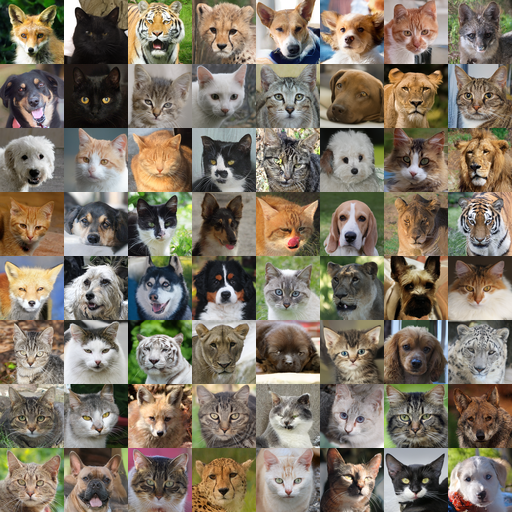

## Consistent Diffusion Models (CDM)<br><sub>Mitigating Sampling Drift by Learning to be Consistent</sub>


**Consistent Diffusion Models**<br>
Giannis Daras(\*), Yuval Dagan(\*), Alexandros G. Dimakis, Constantinos Daskalakis

(\*) authors contributed equally to this work.
<br>Paper link: TBD<br>

Abstract: *Imperfect score-matching leads to a shift between the training and the sampling distribution of diffusion models. Due to the recursive nature of the generation process, errors in previous steps yield sampling iterates that drift away from the training distribution. Yet, the standard training objective via Denoising Score Matching (DSM) is only designed to optimize over non-drifted data. To train on drifted data, we propose to enforce a **consistency** property which states that predictions of the model on its own generated data are consistent across time. 
Theoretically, we show that if the score is learned perfectly on some non-drifted points (via DSM) and if the consistency property is enforced everywhere, then the score is learned accurately everywhere. Empirically we show that our novel training objective yields state-of-the-art results for conditional and unconditional generation in CIFAR-10 and baseline improvements in AFHQ and FFHQ.*


<center>



</center>

| Model               |             | 30k   | 70k   | 100k  | 150k  | 180k  | 200k  | Best  |
|---------------------|-------------|-------|-------|-------|-------|-------|-------|-------|
| **CDM-VP (Ours)**      | AFHQ        | **3.00** | 2.44  | **2.30** | **2.31** | **2.25** | **2.44** | 2.21  |
| EDM-VP (retrained) |             | 3.27  | **2.41** | 2.61  | 2.43  | 2.29  | 2.61  | 2.26  |
| EDM-VP (reported)$^*$ |             |       |       |       |       |       |       | **1.96** |
| EDM-VE (reported)$^*$ |             |       |       |       |       |       |       | 2.16  |
| NCSNv3-VP (reported)$^*$ |             |       |       |       |       |       |       | 2.58  |
| NCSNv3-VE (reported)$^*$ |             |       |       |       |       |       |       | 18.52 |
| **CDM-VP (Ours)**      | CIFAR10 (cond.) | **2.44** | **1.94** | **1.88** | 1.88  | **1.80** | **1.82** | **1.77** |
| EDM-VP (retrained) |             | 2.50  | 1.99  | 1.94  | **1.85** | 1.86  | 1.90  | 1.82  |
| EDM-VP (reported)  |             |       |       |       |       |       |       | 1.79  |
| EDM-VE (reported)  |             |       |       |       |       |       |       | 1.79  |
| NCSNv3-VP (reported) |             |       |       |       |       |       |       | 2.48  |
| NCSNv3-VE (reported) |             |       |       |       |       |       |       | 3.11  |
| **CDM-VP (Ours)**      | CIFAR10 (uncond.) | **2.83** | **2.21** | **2.14** | **2.08** | **1.99** | **2.03** | **1.95** |
| EDM-VP (retrained) |             | 2.90  | 2.32  | 2.15  | 2.09  | 2.01  | 2.13  | 2.01  |
| EDM-VP (reported)  |             |       |       |       |       |       |       | 1.97  |
| EDM-VE (reported)  |             |       |       |       |       |       |       | 1.98  |
| NCSNv3-VP (reported) |             |       |       |       |       |       |       | 3.01  |
| NCSNv3-VE (reported) |             |       |       |       |       |       |       | 3.77 |


## Code Contributions, Acknowledgements and License
This repository is a fork of the [edm repo](https://github.com/NVlabs/edm). We thank the authors for open-sourcing their work and for enabling further research on this area. We make minimal changes to the original repo:
 * We introduce the file `training/samplers.py` that includes the vanilla backward SDE sampler.
 * We add a new loss function in the file `training/loss.py`. The loss function `MartingaleLoss` trains the model with consistency regularization.
 * We make minimal changes to the `train.py` script to use this new loss. To access it, simply train the model with the argument `--precond=cdm`.

This research has been supported by NSF Grants CCF 1763702,
AF 1901292, CNS 2148141, Tripods CCF 1934932, IFML CCF 2019844, the Texas Advanced Computing Center (TACC) and research gifts by Western Digital, WNCG IAP, UT Austin Machine Learning Lab (MLL), Cisco and the Archie Straiton Endowed Faculty Fellowship.
Giannis Daras has been supported by the Onassis Fellowship, the Bodossaki Fellowship and the Leventis Fellowship.
Constantinos Daskalakis has been supported by NSF Awards CCF-1901292, DMS-2022448 and DMS2134108, a Simons Investigator Award, the Simons Collaboration on the Theory of Algorithmic Fairness and a DSTA grant.

To use this code, please refer to the License of the edm repo.

In what follows, we provide the instructions on how to use this code directly from the edm repo.

## Requirements

* Linux and Windows are supported, but we recommend Linux for performance and compatibility reasons.
* 1+ high-end NVIDIA GPU for sampling and 8+ GPUs for training. We have done all testing and development using V100 and A100 GPUs.
* 64-bit Python 3.8 and PyTorch 1.12.0 (or later). See https://pytorch.org for PyTorch install instructions.
* Python libraries: See [environment.yml](./environment.yml) for exact library dependencies. You can use the following commands with Miniconda3 to create and activate your Python environment:
  - `conda env create -f environment.yml -n edm`
  - `conda activate edm`
* Docker users:
  - Ensure you have correctly installed the [NVIDIA container runtime](https://docs.docker.com/config/containers/resource_constraints/#gpu).
  - Use the [provided Dockerfile](./Dockerfile) to build an image with the required library dependencies.


## Pre-trained models

To be released soon.

## Calculating FID

To compute Fr&eacute;chet inception distance (FID) for a given model and sampler, first generate 50,000 random images and then compare them against the dataset reference statistics using `fid.py`:

```.bash
# Generate 50000 images and save them as fid-tmp/*/*.png
torchrun --standalone --nproc_per_node=1 generate.py --outdir=fid-tmp --seeds=0-49999 --subdirs \
    --network=MODEL_LOC

# Calculate FID
torchrun --standalone --nproc_per_node=1 fid.py calc --images=fid-tmp \
    --ref=https://nvlabs-fi-cdn.nvidia.com/edm/fid-refs/cifar10-32x32.npz
```

Both of the above commands can be parallelized across multiple GPUs by adjusting `--nproc_per_node`. The second command typically takes 1-3 minutes in practice, but the first one can sometimes take several hours, depending on the configuration. See [`python fid.py --help`](./docs/fid-help.txt) for the full list of options.

Note that the numerical value of FID varies across different random seeds and is highly sensitive to the number of images. By default, `fid.py` will always use 50,000 generated images; providing fewer images will result in an error, whereas providing more will use a random subset. To reduce the effect of random variation, we recommend repeating the calculation multiple times with different seeds, e.g., `--seeds=0-49999`, `--seeds=50000-99999`, and `--seeds=100000-149999`. In our paper, we calculated each FID three times and reported the minimum.

Also note that it is important to compare the generated images against the same dataset that the model was originally trained with. You can compute the reference statistics for your own datasets as follows:

```.bash
python fid.py ref --data=datasets/my-dataset.zip --dest=fid-refs/my-dataset.npz
```

## Preparing datasets

Datasets are stored in the same format as in [StyleGAN](https://github.com/NVlabs/stylegan3): uncompressed ZIP archives containing uncompressed PNG files and a metadata file `dataset.json` for labels. Custom datasets can be created from a folder containing images; see [`python dataset_tool.py --help`](./docs/dataset-tool-help.txt) for more information.

**CIFAR-10:** Download the [CIFAR-10 python version](https://www.cs.toronto.edu/~kriz/cifar.html) and convert to ZIP archive:

```.bash
python dataset_tool.py --source=downloads/cifar10/cifar-10-python.tar.gz \
    --dest=datasets/cifar10-32x32.zip
python fid.py ref --data=datasets/cifar10-32x32.zip --dest=fid-refs/cifar10-32x32.npz
```

**FFHQ:** Download the [Flickr-Faces-HQ dataset](https://github.com/NVlabs/ffhq-dataset) as 1024x1024 images and convert to ZIP archive at 64x64 resolution:

```.bash
python dataset_tool.py --source=downloads/ffhq/images1024x1024 \
    --dest=datasets/ffhq-64x64.zip --resolution=64x64
python fid.py ref --data=datasets/ffhq-64x64.zip --dest=fid-refs/ffhq-64x64.npz
```

**AFHQv2:** Download the updated [Animal Faces-HQ dataset](https://github.com/clovaai/stargan-v2/blob/master/README.md#animal-faces-hq-dataset-afhq) (`afhq-v2-dataset`) and convert to ZIP archive at 64x64 resolution:

```.bash
python dataset_tool.py --source=downloads/afhqv2 \
    --dest=datasets/afhqv2-64x64.zip --resolution=64x64
python fid.py ref --data=datasets/afhqv2-64x64.zip --dest=fid-refs/afhqv2-64x64.npz
```

**ImageNet:** Download the [ImageNet Object Localization Challenge](https://www.kaggle.com/competitions/imagenet-object-localization-challenge/data) and convert to ZIP archive at 64x64 resolution:

```.bash
python dataset_tool.py --source=downloads/imagenet/ILSVRC/Data/CLS-LOC/train \
    --dest=datasets/imagenet-64x64.zip --resolution=64x64 --transform=center-crop
python fid.py ref --data=datasets/imagenet-64x64.zip --dest=fid-refs/imagenet-64x64.npz
```

## Training new models

You can train new models using `train.py`. For example:

```.bash
# Train DDPM++ model for class-conditional CIFAR-10 using 8 GPUs
torchrun --standalone --nproc_per_node=8 train.py --outdir=training-runs \
    --data=datasets/cifar10-32x32.zip --cond=1 --arch=ddpmpp --precond=cdm
```

The precond argument determines which loss function is going to be used. The default argument, `cdm` uses the loss with consistency regularization as in our paper. To use the `edm` loss, simply run with `--precond=edm`.

The above example uses the default batch size of 512 images (controlled by `--batch`) that is divided evenly among 8 GPUs (controlled by `--nproc_per_node`) to yield 64 images per GPU. Training large models may run out of GPU memory; the best way to avoid this is to limit the per-GPU batch size, e.g., `--batch-gpu=32`. This employs gradient accumulation to yield the same results as using full per-GPU batches. See [`python train.py --help`](./docs/train-help.txt) for the full list of options.

The results of each training run are saved to a newly created directory, for example `training-runs/00000-cifar10-cond-ddpmpp-edm-gpus8-batch64-fp32`. The training loop exports network snapshots (`network-snapshot-*.pkl`) and training states (`training-state-*.pt`) at regular intervals (controlled by `--snap` and `--dump`). The network snapshots can be used to generate images with `generate.py`, and the training states can be used to resume the training later on (`--resume`). Other useful information is recorded in `log.txt` and `stats.jsonl`. To monitor training convergence, we recommend looking at the training loss (`"Loss/loss"` in `stats.jsonl`) as well as periodically evaluating FID for `network-snapshot-*.pkl` using `generate.py` and `fid.py`.

The following table lists the exact training configurations that we used and reference hardware/compute requirements:

| <sub>Model</sub> | <sub>GPUs</sub> | <sub>Time</sub> | <sub>Options</sub>
| :-- | :-- | :-- | :--
| <sub>cifar10&#8209;32x32&#8209;cond&#8209;vp</sub>   | <sub>8xV100</sub>  | <sub>~3&nbsp;days</sub>  | <sub>`--cond=1 --arch=ddpmpp`</sub>
| <sub>cifar10&#8209;32x32&#8209;uncond&#8209;vp</sub> | <sub>8xV100</sub>  | <sub>~3&nbsp;days</sub>  | <sub>`--cond=0 --arch=ddpmpp`</sub>
| <sub>afhqv2&#8209;64x64&#8209;uncond&#8209;vp</sub>  | <sub>8xV100</sub>  | <sub>~6&nbsp;days</sub>  | <sub>`--cond=0 --arch=ddpmpp --batch=256 --cres=1,2,2,2 --lr=2e-4 --dropout=0.25 --augment=0.15`</sub> 

We note that our consistency regularization increases the training time by a factor of $\approx \times1.5$ using the default configuration compared to the `edm` baseline.


